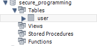

# 安全编程技术-课程报告-Lab1.1&1.2

[TOC]

## Lab1.1

### 安装Java环境


如图所示，本机在实验之前已安装JDK

### 安装Tomcat

- 下载Tomcat-10.1.8


- 配置环境变量

根据RUNNING.txt中的步骤设置环境变量


- 启动Tomcat成功


- 解决Tomcat乱码

修改`TomcatFolder/conf/logging.properties`中的`java.util.logging.ConsoleHandler.encoding`为GBK即可

再次启动发现已无乱码


### 安装eclipse

征得助教同意之后使用IDEA替代eclipse。

本机在实验之前已经安装IDEA。

新建项目并运行HelloWorld成功


## Lab1.2

### 应用场景

一个用户登录与注册的界面。

用户可以在界面上输入账号密码登录，登录成功之后页面会有提示。

用户可以在界面上输入账号和两次密码注册，要求注册密码和二次输入的密码相同。

app采用前后端分离的架构，前端准备使用原生html+css+js，后端准备使用node.js配koa-router。

### 创建数据库

建`user`表



表中有一个自增主键`iduser`，以及对应的用户`uname`和`password`。


### 开发

#### 前端

前端采用原生html+css+js

html的主体是两个form，以登录的form为例：

```html
<div class="card">
    <div class="title">Login</div>
    <form>
        <input id="login-uname" required type="text" placeholder="user name" />
        <input id="login-pd" required type="password" placeholder="password" />
        <button class="button login-button">login</button>
    </form>
</div>
```

主要采用了flex布局

在javascript中取消了原生的表单提交，转而给按钮绑定自定义的提交事件。

以login按钮的为例：

```js
function login() {
    //使用ES6自带的fetch发送网络请求
}

//取消原生表单提交事件
const forms = document.querySelectorAll('form');
forms.forEach(form => form.addEventListener('submit', function(event) {
    event.preventDefault();
}))

//给按钮添加自定义提交事件
let loginButton = document.querySelector('.login-button');
loginButton.addEventListener('click', login);
```

#### 后端

后端采用node.js+koa-router。

后端连接本地数据库，配置`/login`和`/register`两个路由。

采用CORS中间件解决前后端跨域问题。

await被Promise包裹的query语句达到同步执行数据库查询的功能。

#### API list

详见源码文件夹中`README.md`

### 部署WebAPP

#### 一点小插曲（服务器部署）

刚开始准备直接部署在自己的服务器上，虽然搞好了服务器上的配置，过了几天发现服务器上的mysql由于密码太简单被攻击了（X


考虑到后续重新配好数据库也有再次被攻击导致后端崩溃的可能，遂决定部署在本地。

#### 本地部署

##### 使用Nginx部署

- 配置`nginx.conf`

```nginx
server {
        listen       82;
        server_name  localhost;

        location / {
            root   c:\users\GXLYQ_AIR\Desktop\login-register\login-register-fe;
            index  index.html index.htm;
        }
        
        location /api {
            proxy_pass http://localhost:3001;
            proxy_set_header Host $host;
            proxy_set_header X-Real-IP $remote_addr;
            proxy_set_header X-Forwarded-For $proxy_add_x_forwarded_for;
        }

        error_page   500 502 503 504  /50x.html;
        location = /50x.html {
            root   html;
        }
    }
```

- 本地起后端服务，监听3001端口即可完成部署

##### 部署测试

在浏览器中访问`http://localhost:82`，网页正常呈现


尝试登录，成功


### 测试

准备测试环境：

- 清空数据库


使用已经部署完成的网站进行测试

#### 注册

##### 正常注册

使用账号`test`，密码`password`注册


提示用户注册成功

检查数据库，可见数据成功写入


##### 用户名已存在

继续使用`test`用户名进行注册


提示用户名已存在

检查数据库，发现并没有新数据写入


##### 两次密码输入不一致

在二次密码输入栏中输入不同的密码


前端正常提示两个密码不同，请求已在前端被阻拦，后端不会收到新请求。

检查数据库，并没有新数据写入


#### 登录

##### 正常登录

输入账号`test`和密码`password`，尝试登录。


可见登录成功。

##### 用户名不存在

尝试使用账号`test2`登录


可见前端提示用户名不存在或者密码错误

##### 密码错误

尝试使用账号`test`，密码`fakepassword`登录


可见前端提示用户名不存在或者密码错误。
